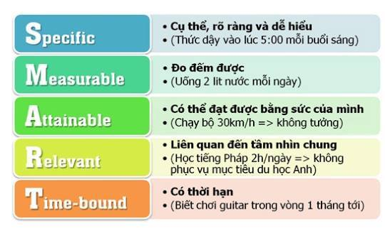

# Overview
This is our developer docs about `Target - Planning`

## Define Target
A target need to be satisfied SMART

1. S – Specific : Cụ thể, dễ hiểu.
2. M – Measurable : Đo lường được
3. A – Attainable : Có thể đạt được
4. R – Relevant : Thực tế
5. T – Time-Bound : Thời gian hoàn thành

http://ivyprep.edu.vn/study/xac-dinh-muc-tieu-theo-nguyen-tac-smart/

