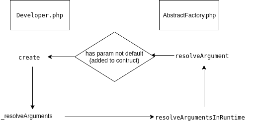

# More information about Magento Framework

## Object Manager
- [Object Manager Devdocs](https://devdocs.magento.com/guides/v2.3/extension-dev-guide/object-manager.html)
- Object manager used to create new object instance and retrieve cached object instance all object in Magento at anywhere. View class `vendor/magento/framework/ObjectManagerInterface.php`.
    ```php
    interface ObjectManagerInterface
    {
        /**
         * Create new object instance
         *
         * @param string $type
         * @param array $arguments
         * @return mixed
         */
        public function create($type, array $arguments = []);
    
        /**
         * Retrieve cached object instance
         *
         * @param string $type
         * @return mixed
         */
        public function get($type);
    
        /**
         * Configure object manager
         *
         * @param array $configuration
         * @return void
         */
        public function configure(array $configuration);
    }
    ```
- Detail more than about Object manager, how Magento initiation Object manager.
    1. at `index.php`, 
        ```php
        $bootstrap = \Magento\Framework\App\Bootstrap::create(BP, $_SERVER);
        ```  
    2. at `vendor/magento/framework/App/Bootstrap.php`
        ```php
        public static function create($rootDir, array $initParams, ObjectManagerFactory $factory = null)
        {
            self::populateAutoloader($rootDir, $initParams);
            if ($factory === null) {
                $factory = self::createObjectManagerFactory($rootDir, $initParams);
            }
    
            return new self($factory, $rootDir, $initParams);
        }
        ...
        public static function createObjectManagerFactory($rootDir, array $initParams)
        {
            $dirList = self::createFilesystemDirectoryList($rootDir, $initParams);
            $driverPool = self::createFilesystemDriverPool($initParams);
            $configFilePool = self::createConfigFilePool();
            return new ObjectManagerFactory($dirList, $driverPool, $configFilePool);
        }
        ...
        public function __construct(ObjectManagerFactory $factory, $rootDir, array $initParams)
        {
            $this->factory = $factory;
            $this->rootDir = $rootDir;
            $this->server = $initParams;
            $this->objectManager = $this->factory->create($this->server);
        }
        ```
        Magento init ObjectManagerFactory, and from ObjectManagerFactory init ObjectManagerInterface.
        
    3. at `vendor/magento/framework/App/ObjectManagerFactory.php`
        ```php
        public function create(array $arguments)
        {
			/** @var EnvironmentFactory $envFactory */
            $envFactory = new $this->envFactoryClassName($relations, $definitions);
            /** @var EnvironmentInterface $env */
            $env = $envFactory->createEnvironment();
     
        	/** @var ConfigInterface $diConfig */
            $diConfig = $env->getDiConfig();
     
        	if ($env->getMode() != Environment\Compiled::MODE) {
                $configData = $this->_loadPrimaryConfig($this->directoryList, $this->driverPool, $argumentMapper, $appMode);
                if ($configData) {
                    $diConfig->extend($configData);
                }
            }
     
        	$this->factory = $env->getObjectManagerFactory($arguments);
            /** @var \Magento\Framework\ObjectManagerInterface $objectManager */
            $objectManager = new $this->_locatorClassName($this->factory, $diConfig, $sharedInstances);
            $this->factory->setObjectManager($objectManager);
        	$env->configureObjectManager($diConfig, $sharedInstances);
    
            return $objectManager;
        }
        ```
        Magento EnvironmentInterface distinguish mode: `Environment\Compiled::MODE` or else. At `vendor/magento/framework/App/EnvironmentFactory.php`
        ```php
        public function createEnvironment()
        {
            switch ($this->getMode()) {
                case Compiled::MODE:
                    return new Compiled($this);
                    break;
                default:
                    return new Developer($this);
            }
        }
        ```
        Mode Compiled after run command `php bin/magento setup:di:compile`, Magento will compile all config to one file php contain config at folder `generated/metadata` with every area: global, .... It usually map with Magento application mode as production. In Magento application mode as developer, folder `generated/metadata` will be deleted.
        
        In mode Compiled, `$diConfig = $env->getDiConfig();` will get config from file php after compiled. Else in mode Developer, `$configData = $this->_loadPrimaryConfig($this->directoryList, $this->driverPool, $argumentMapper, $appMode);` will help magento read config from file xml `app/etc/di.xml`.
        
        At line `$this->factory = $env->getObjectManagerFactory($arguments);`, Magento init factory from `$env` in class `AbstractEnvironment.php`. This factory used to init `$objectManager` and this object be set to this factory `$this->factory->setObjectManager($objectManager);`
        
    4. at `index.php`
        ```php
        $app = $bootstrap->createApplication(\Magento\Framework\App\Http::class);
		$bootstrap->run($app);
        ```
        In `Bootstrap.php`, object manager used to create application.
        
- Magento initiation ObjectManager follow design pattern Singleton

- Use object manger to create and retrieve object at anywhere in Magento. 
	```php
	$objectClassCreateNew = \Magento\Framework\App\ObjectManager::getInstance()
                ->create($typeClassName);
	```
	```php
	$objectClassRetrieve = \Magento\Framework\App\ObjectManager::getInstance()
                ->get($typeClassName);
	```
	```php
	private $_objectManager;
    
    public function __construct(
        \Magento\Framework\ObjectManagerInterface $objectmanager
    ){
        $this->_objectManager = $objectmanager;
    }

    public function getExample()
    {
        $customerSession = $this->_objectManager->create("Magento\Customer\Model\Session");
        if ($customerSession->isLoggedIn()) {
            $customerData = $customerSession->getCustomer()->getData();
            /*Your logic*/
        }
    }
	```
- Detail more than how Object manager create and retrieve object, how inject interface to `__construct` of one class but Magento still inject extract object implement this interface.
	
	1. When call `\Magento\Framework\App\ObjectManager::getInstance()->create($typeClassName)`, Magento create object (view file `vendor/magento/framework/ObjectManager/ObjectManager.php`)
	```php
	public function create($type, array $arguments = [])
    {
        return $this->_factory->create($this->_config->getPreference($type), $arguments);
    }
	```
	`$this->_factory` created when Object manager created and it is `new Developer($this);` created in file `App/EnvironmentFactory.php`
	2. in file `vendor/magento/framework/ObjectManager/Factory/Dynamic/Developer.php`
	```php
	public function create($requestedType, array $arguments = [])
    {
        $type = $this->config->getInstanceType($requestedType);
        $parameters = $this->definitions->getParameters($type);
        if ($parameters == null) {
            return new $type();
        }
        if (isset($this->creationStack[$requestedType])) {
            $lastFound = end($this->creationStack);
            $this->creationStack = [];
            throw new \LogicException("Circular dependency: {$requestedType} depends on {$lastFound} and vice versa.");
        }
        $this->creationStack[$requestedType] = $requestedType;
        try {
            $args = $this->_resolveArguments($requestedType, $parameters, $arguments);
            unset($this->creationStack[$requestedType]);
        } catch (\Exception $e) {
            unset($this->creationStack[$requestedType]);
            throw $e;
        }

        return $this->createObject($type, $args);
    }
	```
	`$type` is instance set up in file `di.xml`. `$parameters` is list of method parameters of `$type`. `$args` is recursive to resolve constructor arguments.
	
		
		
## Magento 2 request flow overview
1. Some documents: 
    - https://www.atwix.com/magento-2/request-flow-overview/
    - https://nathanmcbride.io/magento2/Request-Flow-In-Magento-2
    
## CLI Command
- [Add CLI Command devdocs](https://devdocs.magento.com/guides/v2.3/extension-dev-guide/cli-cmds/cli-add.html)

## Events and observers
- [Events and observers](https://devdocs.magento.com/guides/v2.3/extension-dev-guide/events-and-observers.html)
- Event and observers in Magento is synchronize. When you call dispatch event with a object, magento will read all observers in all file `events.xml`, call observers listen of this event and execute function `execute` in observers. 