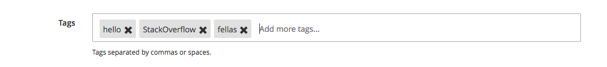

# Magento 2.1 Ui Component form field Tags Input
- Everything is possible with UI Components because it's really flexible as its introductions.
  
    Otherwise, I don't think depending/overriding on default UI element (like you mentioned in the post - ui-select) is a good idea. So, in this tutorial, I will create a new UI element for the tags. It could be use not only in product form but the cms page form or whatever depends on the UI forms.
  
    Now let the fun begin!
  
    Firstly, your ui_component form should looks like this: `StackOverflow/Catalog/view/adminhtml/ui_component/product_form.xml`
    ```xml
    <field name="parent">
      <argument name="data" xsi:type="array">
          <item name="config" xsi:type="array">
              <item name="label" xsi:type="string" translate="true">Tags</item>
              <item name="componentType" xsi:type="string">field</item>
              <item name="formElement" xsi:type="string">input</item>
              <item name="component" xsi:type="string">StackOverflow_Catalog/js/form/element/tags</item>
              <item name="elementTmpl" xsi:type="string">StackOverflow_Catalog/form/element/tags</item>
              <item name="dataScope" xsi:type="string">data.parent</item>
              <item name="filterOptions" xsi:type="boolean">true</item>
              <item name="showCheckbox" xsi:type="boolean">false</item>
              <item name="disableLabel" xsi:type="boolean">true</item>
              <item name="levelsVisibility" xsi:type="number">1</item>
              <item name="sortOrder" xsi:type="number">20</item>
              <item name="required" xsi:type="boolean">true</item>
              <item name="validation" xsi:type="array">
                  <item name="required-entry" xsi:type="boolean">true</item>
              </item>
              <item name="listens" xsi:type="array">
                  <item name="${ $.namespace }.${ $.namespace }:responseData" xsi:type="string">setParsed</item>
              </item>
          </item>
      </argument>
    </field>
    ```
    
    Take a note to formElement, component and elementTmpl. It should be a normal input field.
    
    Now, we need to create the view renderer for that UI element: `StackOverflow/Catalog/view/base/web/js/form/element/tags.js`
    ```js
    define([
        'underscore',
        'mageUtils',
        'Magento_Ui/js/form/element/abstract',
        'ko',
        'Magento_Ui/js/lib/validation/validator'
    ], function (_, utils, Element, ko, validator) {
        'use strict';
    
        return Element.extend({
            defaults: {
                list: ([]),
                valueUpdate: 'afterkeydown',
                listens: {
                    'valueArea': 'onUpdateArea'
                }
            },
    
            initialize: function () {
                this._super();
                this.on('value', this.onUpdateArea.bind(this));
                var self = this;
                var list = this.value().split(',');
                _.each(list, function (value, index) {
                    if (value.length > 0) {
                        self.list.push(value.trim());
                    }
                });
    
                return this;
            },
    
            initObservable: function () {
                this._super();
                this.observe(['valueArea']);
                this.observe('list', this.list);
                return this;
            },
    
            onUpdateArea: function (value) {
                if (value.length > 1) {
                    if (value.indexOf(',') !== -1 || value.indexOf(' ') !== -1) {
                        var newValue = value.slice(0, -1);
                        this.correctValue(newValue);
                    }
                }
            },
    
            correctValue: function (tag) {
                if (this.hasTag(tag)) {
                    this.valueArea('');
                    return false;
                }
                if (this.isValidTag(tag).passed) {
                    this.list.push(tag);
                    this.joinList(this.list());
                    this.valueArea('');
                    return true;
                }
    
                return false;
            },
    
            isValidTag: function (tag) {
                return validator('validate-alphanum', tag);
            },
    
            OnBlurEvent: function (object) {
                if (this.valueArea() && this.valueArea().length > 0) {
                    if (!this.correctValue(this.valueArea())) {
                        this.valueArea('');
                    }
                }
            },
    
            deleteTag: function (self, value, event) {
                event ? event.stopPropagation() : false;
                var key = -1;
                _.each(this.list(), function (element, index) {
                    if (value === element) {
                        key = index;
                    }
                });
                if (key > -1) {
                    this.list.splice(key, 1);
                    this.joinList(this.list());
                    this.valueArea('');
                }
            },
    
            joinList: function (array) {
                this.value(array.join(','));
            },
    
            hasTag: function (value) {
                return this.list().indexOf(value) !== -1;
            }
        });
    });
    ```
    
    the knockout template is on the way... `StackOverflow/Catalog/view/base/web/template/form/element/tags.html`
    
    ```html
    <div class="tags">
        <div class="admin__control-text">
            <div class="apps-share-chips-editor">
                <input class="admin__control-text" type="hidden"
                       data-bind="
            value: value,
            valueUpdate: valueUpdate,
            attr: {
                name: inputName,
                placeholder: placeholder,
                'aria-describedby': noticeId,
                id: uid,
                disabled: disabled
        }"/>
                <span data-bind="foreach: { data: list, as: 'item' }">
                    <span class="field-tag-chip">
                    <div class="field-tag-content" data-bind="text: item"></div>
                    <div class="field-tag-close-before">
                        <span class="field-tag-close" data-bind="event: {click: $parent.deleteTag.bind($parent, $index)}"></span>
                    </div>
                    </span>
                </span>
                <textarea
                        class="field-tag-input" placeholder="Add more tags..." data-bind="
            event: {change: userChanges, blur: OnBlurEvent},
            hasFocus: focused,
            valueUpdate: valueUpdate,
            value: valueArea
            "></textarea>
            </div>
        </div>
    </div>
    ```
    
    some styling maybe?... `StackOverflow/Catalog/view/base/web/css/tags.css`
    
    ```css
    .field-tag-content {
        display: inline-block;
        overflow: hidden;
        text-overflow: ellipsis;
        vertical-align: middle;
        white-space: nowrap;
    }
    
    .field-tag-chip {
        background: #e0e0e0;
        border: 1px solid #e0e0e0;
        display: inline-block;
        -webkit-border-radius: 3px;
        color: #444;
        margin: 4px 1px 0 2px;
        outline: none;
        vertical-align: middle;
        cursor: default;
        padding: 0;
        -webkit-border-radius: 2px;
        border-radius: 2px;
        overflow: hidden;
        padding:5px;
        padding-right:25px;
    }
    
    .field-tag-input {
        display: inline-block;
        margin: 10px 4px 0 4px;
        vertical-align: middle;
        background: none;
        border: 0;
        height: 25px;
        outline: 0;
        overflow-x: hidden;
        overflow-y: auto;
        padding: 0 0 0 5px;
        position: relative;
        resize: none;
        width:50%;
    }
    .field-tag-close-before {
        position:relative;
    }
    .field-tag-close{
        position: absolute;
        top: -10px;
        right: -5px;
        cursor: pointer;
    }
    
    .field-tag-close:before,
    .field-tag-close:after {
        content: "";
        position: absolute;
        top: 0px;
        left: 0px;
        width: 15px;
        height: 4px;
        background: #303030;
    }
    
    .field-tag-close:before {
        webkit-transform: rotate(45deg);
        transform: rotate(45deg);
    }
    
    .field-tag-close:after {
        webkit-transform: rotate(-45deg);
        transform: rotate(-45deg);
    }
    ```
    
    And finally, you will need to add your `tags.css` to the `view/adminhtml/layout/catalog_product_edit.xml` and the `view/adminhtml/layout/catalog_product_new.xml`.
    
    So that it's it! Now your input should look like this:
    
    